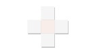
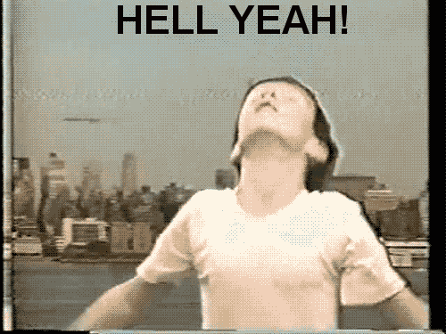

# Jeu Touché-Coulé
À l'aide de vos apports progressifs, guidé sur 9 étapes, vous allez pouvoir compléter ce projet de jeu ludique.

Voici à quoi ressemblera l'application une fois terminée, au cours d'une session de jeu :  

## A lire avant toute chose 
Ce projet contient plusieurs distributions de JavaFX dont certaines probablement inutiles pour vous.

Pour comprendre comment faire fonctionner ce projet Java, il est **important** de [prendre connaissance et tenir compte de ces explications](/README-JavaFX.md)) avant d'aller plus loin !

## Objectifs
- Révision des concepts vus au 1er module Java 319 (algorithmique)
- Révision des concepts vus au 2ème module Java D400 (classes, énumérations, attributs, constructeurs, getters/setters, méthodes, ...)
- Lecture de diagrammes UML de classes et de séquence
- Apprendre a focaliser sur un problème à la fois sans perdre de vue l'ensemble
- Identification des difficultés éventuelles afin de vous préparer au mieux à l'évaluation et au module suivant (226a)

## Etape N°01 - Générer correctement des nombres aléatoires
Terminez l'implémentation de la classe `NbresAleatoires` dans le package `services`.  

Lisez bien la javadoc qui s'y trouve et implémentez ces 2 méthodes. Ce sera une bonne révision de votre 1er module Java.

## Etape N°02 - Les classes `Coordonnee` et `Decalage`
Ces deux classes `Coordonnee` et `Decalage`, sont vraiment centrales à cette application.

D'une part chaque bateau aura une position spécifique sur la grille de jeu. Cette caractéristique de chaque bateau (sa position) sera une `Coordonnee`. Changer la coordonnée d'un bateau déplace l'ensemble du bateau sur la grille de jeu.

D'autre part, un bateau n'est que rarement composé de son seul poste de pilotage, mais de plusieurs parties formant toutes ensemble le bateau. Chacune de ces `PartieDeBateau` (une classe que vous écrirez un peu plus tard) occuperont elles aussi une position sur la grille de jeu, mais cette position sur la grille de jeu ne sera pas une **position absolue** (une `Coordonnee`) mais une **position relative** (c-à-d un `Decalage`) par rapport à la position du poste de pilotage du bateau.

Cette astuce simplificatrice résoud de nombreux problème. Un bateau n'aura donc qu'une seule coordonnée, celle de son poste de pilotage. Modifier cette position déplacera l'ensemble du bateau avec toutes ses parties :-)

L'image ci-dessous explique cela :  

Ci-dessous un diagramme UML de ces classes :

Implémentez ces deux classes en respect du diagramme de classes ci-dessus.

Pour leur implémentation, les commentaires Javadoc fournis dans ces deux classes vous guideront sur ce que telle ou telle méthode doit faire.

## Etape N°03 - L'énumération `EtatSurfaceMaritime` décrivant l'état de chaque cellule sur la grille de jeu
Une fois la partie débutée, chaque cellule de la grille de jeu sera forcément dans l'un de ces 4 états :
- **INTACT**, c-à-d que ni le joueur ni l'ordinateur n'auront encore tiré à cette coordonnée
- **JOUEUR_A_TIRE**, c-à-d que seul le joueur aura tiré à cette coordonnée
- **ORDI_A_TIRE**, c-à-d que seul l'ordinateur aura tiré à cette coordonnée
- **JOUEUR_ET_ORDI_ONT_TIRE**, c-à-d que tant le joueur que l'ordinateur auront tiré à cette coordonnée

Ci-dessous le diagramme UML de cette énumération d'états :

Implémentez cette énumération comme appris en module, dans le bon package `models`.

## Etape N°04 - Les classes `Bateau` et `PartieDeBateau`
Vous allez maintenant implémenter les deux classes `Bateau` et `PartieDeBateau`.

Pour réaliser cela, lisez avec attention les indications qui sont fournies sous forme de Javadoc directement dans les classes concernées.  
Vous trouverez également ci-dessous des indications utiles :
- [Diagrammes UML de ces deux classes](#1-diagrammes-uml-de-ces-deux-classes)
- [Algorithme pour réaliser la rotation d'un bateau sur une grille de jeu](#2-algorithme-pour-réaliser-la-rotation-dun-bateau-sur-une-grille-de-jeu)

### 1) Diagrammes UML de ces deux classes

### 2) Algorithme pour réaliser la rotation d'un bateau sur une grille de jeu

Par chance c'est beaucoup plus simple qu'il n'y paraît de prime abord ! Car en effet un bateau n'a qu'une seule coordonnée, celle de son poste de pilotage, et **cette position restera totalement inchangée par la rotation**.

Une rotation à droite de 90° n'affecte que les "décalages" des parties du bateau. Par chance, le calcul des nouveaux décalages et très simple et toujours identique, peu importe "le cadran" dans lequel ces décalages se trouvent.

Observez avec attention les informations fournies dans cette image qui explique la logique a appliquer pour réaliser une rotation de 90° d'un bateau :  

Avant de poursuivre avec l'implémentation de la rotation, vous devriez comprendre :
- la position du poste de pilotage
- le système de décalages utilisé pour définir la position de chacune des parties d'un bateau
- la détermination du cadran dans lequel on se trouve avec l'une ou l'autre partie d'un bateau
- la formule a utiliser pour réaliser la rotation d'une partie de bateau
- l'exemple de rotation d'une partie de bateau (en bas à droite de l'image)

Si l'un ou l'autre des points qui précède n'est pas clair pour vous, **inutile de tenter de poursuivre**. Clarifiez ces points par une relecture plus attentionnée et, si nécessaire, avec des échanges avec vos collègues ou avec le prof qui se fera un plaisir de vous mettre sur la bonne piste.

## Etape N°05 - Le service `BateauxEtat`
Vous allez maintenant implémenter la classe service `BateauxEtat` qui permet de facilement déterminer le nombre de bateaux coulés et le nombre de parties de bateaux qui restent encore à toucher.

La fonctionnalité désirée y est clairement définie sous forme de Javadoc. Lisez avec attention et implémentez ces méthodes tel que demandé. Ce sera une bonne révision des tableaux et algorithmique du module précédent.

## Etape N°06 - Le service `BateauxNouveaux`
Vous allez maintenant implémenter la classe service `BateauxNouveaux` qui permet de créer des nouveaux bateaux.

La fonctionnalité désirée y est à nouveau clairement définie sous forme de Javadoc. Lisez avec attention et implémentez ces méthodes tel que demandé.

Pour correctement créer toutes les parties de bateau nécessaires, voici un petit récapitulatif des types de bateaux que le jeu connaît. Il s'agit de (en rose la position du poste de pilotage du bateau) :

| N°      | Type de bateau | Image     |
| :---:        |    :----   |  :----: |
| 1 | Porte-Avions |  |
| 2 | Croiseur |  |
| 3 | Torpilleur |  |
| 4 | Cuirassé |  |
| 5 | Sous-marin |  |

## Etape N°07 - Le service `BateauxDeplacement`
C'est la dernière étape à réaliser avant d'avoir un jeu fonctionnel !

Vous allez maintenant implémenter la classe service `BateauxDeplacement` qui permet de réaliser des déplacements ou rotation de bateaux.

La fonctionnalité désirée y est clairement définie sous forme de Javadoc. Lisez avec attention et respectez la fonctionnalité désirée.

## Etape N°08 - Tester, tester, tester...
C'est une étape incontournable dans le processus de développement : tester, tester, tester !

Il faut vraiment tester avec attention, tous les cas de figure, et noter les erreurs éventuelles.

Pour chacune des erreurs rencontrées, il faut idéalement trouver un scénario **le plus simple possible** permettant de reproduire le problème !

Un scénario clair et précis vous permettra, à l'aide du débogueur, de mettre les points d'arrêt aux bons "endroits" afin de rapidement identifier la source du problème, comprendre l'erreur commise, ... pour finir par solutionner celle-ci. 

Et ensuite on recommence : vérifier que c'est bien le cas.

## Etape N°09 - Indispensable : se féliciter du chemin accompli !
Si vous êtes arrivés jusqu'ici, peu importe qu'il reste ou non des bugs à corriger : **FÉLICITATIONS !**

Car c'est bien le travail fourni (et non le résultat temporairement obtenu) qui vous auront beaucoup appris !

C'est bien le chemin accompli qui vous auront apporté des enseignements (et non la destination atteinte qui elle apporte des émotions). Pensez-y : si on ne se décourage pas et qu'on continue d'avancer, peu importe la distance qui reste à parcourir, on y arrivera !!! ;-)

Vive la programmation ! Si tout fonctionne comme prévu ... quel plaisir, vous ressentirez une émotion dans ce genre-là :

| Bravo ! | Le travail paie ! | Félicitations ! |
| :---: | :---: | :---: |
|  |  |  |
|  |  |  |
